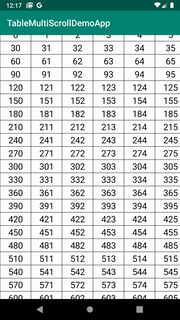
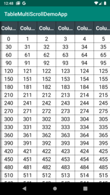
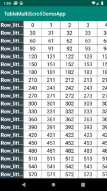
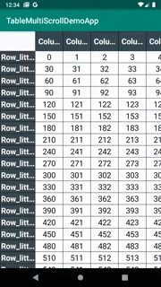
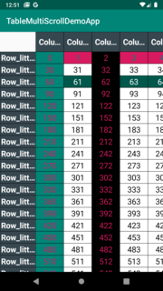

[](https://app.codacy.com/gh/kaygenzo/TableMultipleScroll/dashboard?utm_source=gh&utm_medium=referral&utm_content=&utm_campaign=Badge_grade)

# Android Multi Scroll Table

 This library intends to provide a way to create a table that can be scrolled horizontally and vertically and where cells can be customized

 ## Installation

 ```groovy
 implementation "io.github.kaygenzo:androidtable:$androidtableVersion"
 ```

 ## Usage

 ```xml
 <io.github.kaygenzo.androidtable.api.AndroidTableView
        android:id="@+id/multipleScrollTableView"
        android:layout_width="match_parent"
        android:layout_height="match_parent"/>
 ```

 ### 1. Simple table



```kotlin
val mainData = mutableListOf<List<CellConfiguration>>()
val rowCount = 40
val columnCount = 30
for (i in 0 until rowCount) {
    val data = mutableListOf<CellConfiguration>()
    mainData.add(data)
    for (j in 0 until columnCount) {
        data.add(CellConfiguration("${(i*columnCount) + j}", j))
    }
}
multipleScrollTableView.setMainData(mainData)
 ```

 ### 2. Top header table



```kotlin
val mainData = mutableListOf<List<CellConfiguration>>()
val topHeaderData = mutableListOf<CellConfiguration>()
val rowCount = 40
val columnCount = 30
for (i in 0 until columnCount) {
    topHeaderData.add(CellConfiguration("Column_little_long_$i", i))
}
for (i in 0 until rowCount) {
    val data = mutableListOf<CellConfiguration>()
    mainData.add(data)
    for (j in 0 until columnCount) {
        data.add(CellConfiguration("${(i*columnCount) + j}", j))
    }
}
multipleScrollTableView.setTopHeaderData(topHeaderData)
multipleScrollTableView.setMainData(mainData)
```

### 3. Left header table



```kotlin
val mainData = mutableListOf<List<CellConfiguration>>()
val leftHeaderData = mutableListOf<CellConfiguration>()
val rowCount = 40
val columnCount = 30
for (i in 0 until rowCount) {
    leftHeaderData.add(CellConfiguration("Row_little_long_$i"))
}
for (i in 0 until rowCount) {
    val data = mutableListOf<CellConfiguration>()
    mainData.add(data)
    for (j in 0 until columnCount) {
        data.add(CellConfiguration("${(i*columnCount) + j}", j))
    }
}
multipleScrollTableView.setLeftHeaderData(leftHeaderData)
multipleScrollTableView.setMainData(mainData)
```

### 4. Top and left header table



```kotlin
val mainData = mutableListOf<List<CellConfiguration>>()
val topHeaderData = mutableListOf<CellConfiguration>()
val leftHeaderData = mutableListOf<CellConfiguration>()
val rowCount = 40
val columnCount = 30
for (i in 0 until rowCount) {
    leftHeaderData.add(CellConfiguration("Row_little_long_$i"))
}
for (i in 0 until columnCount) {
    topHeaderData.add(CellConfiguration("Column_little_long_$i", i))
}
for (i in 0 until rowCount) {
    val data = mutableListOf<CellConfiguration>()
    mainData.add(data)
    for (j in 0 until columnCount) {
        data.add(CellConfiguration("${(i*columnCount) + j}", j))
    }
}
multipleScrollTableView.setTopHeaderData(topHeaderData)
multipleScrollTableView.setLeftHeaderData(leftHeaderData)
multipleScrollTableView.setMainData(mainData)
```

### 5. Highlights



You can Highlight columns or rows by adding specific styles at specific indexes

```kotlin
val columnHighlights = mutableListOf<Highlight>()
columnHighlights.add(Highlight(0, StyleConfiguration(cellDefaultBackgroundColor = R.color.colorAccent, cellDefaultTextColor = R.color.colorPrimary)))
columnHighlights.add(Highlight(2, StyleConfiguration(cellDefaultBackgroundColor = R.color.colorPrimaryDark, cellDefaultTextColor = android.R.color.white)))
multipleScrollTableView.setRowHighlights(columnHighlights)

val rowsHighlights = mutableListOf<Highlight>()
rowsHighlights.add(Highlight(0, StyleConfiguration(cellDefaultBackgroundColor = R.color.colorPrimary, cellDefaultTextColor = R.color.colorAccent)))
rowsHighlights.add(Highlight(2, StyleConfiguration(cellDefaultBackgroundColor = android.R.color.black, cellDefaultTextColor = R.color.colorAccent)))
multipleScrollTableView.setColumnHighlights(rowsHighlights)
```

In the specific case when a row cross a column, you can specify the strategy to apply. By default, the priority is column

```kotlin
multipleScrollTableView.setHighlightsConflictStrategy(HighlightConflictStrategy.PriorityColumn)
```

### 6. Click on cell listener

```kotlin
multipleScrollTableView.setOnTableClickListener(object : OnTableClickListener {
    override fun onCellClicked(text: String, row: Int, column: Int) {
        Toast.makeText(this@MainActivity, "text:$text row:$row column:$column", Toast.LENGTH_SHORT).show()
    }
})
```

### 7. Customize cells style

```kotlin
multipleScrollTableView.setTopHeaderStyle(
   StyleConfiguration(
       cellTextSize = R.dimen.default_table_multiple_scroll_text_size,
       cellTextTypeface = Typeface.DEFAULT_BOLD,
       cellDefaultTextColor = R.color.default_table_multiple_scroll_header_text_color,
       cellDefaultBackgroundColor = R.color.default_table_multiple_scroll_header_background_color,
       linesCount = 1,
       truncateStrategy = TextUtils.TruncateAt.END
))
```

### 8. Add a custom view in the top left view
```kotlin
val spinner = Spinner(this).apply {
    adapter =
        ArrayAdapter(this@MainActivity, R.layout.adapter_item, arrayOf("Test1", "Test2"))
}
binding.multipleScrollTableView.setTopLeftCellCustomView(spinner)
```

### 8. Limitations

* The cells styling is limited to 3 blocks: Left header, Top header and Main table. You cannot change individually each cell style into the same block
* The Highlight strategy is established for all the table, you cannot have 2 different strategies for multiple indexes

## Contributing
Pull requests are welcome. For major changes, please open an issue first to discuss what you would like to change.

Please make sure to update tests as appropriate.

## License
    Licensed under the Apache License, Version 2.0 (the "License");
    you may not use this file except in compliance with the License.
    You may obtain a copy of the License at

       http://www.apache.org/licenses/LICENSE-2.0

    Unless required by applicable law or agreed to in writing, software
    distributed under the License is distributed on an "AS IS" BASIS,
    WITHOUT WARRANTIES OR CONDITIONS OF ANY KIND, either express or implied.
    See the License for the specific language governing permissions and
    limitations under the License.
